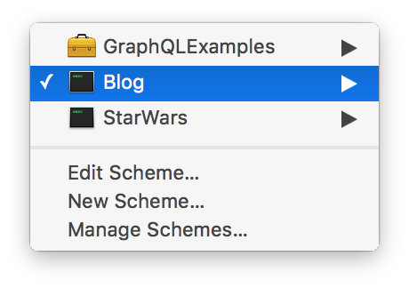
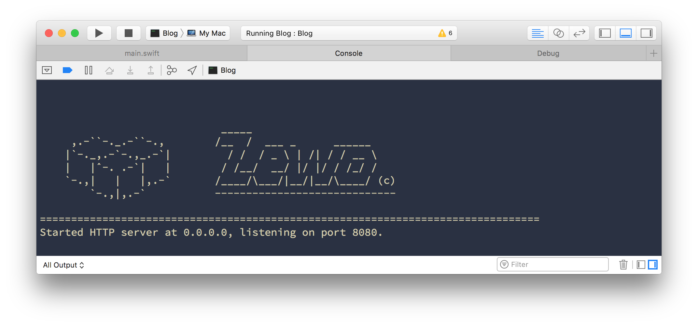
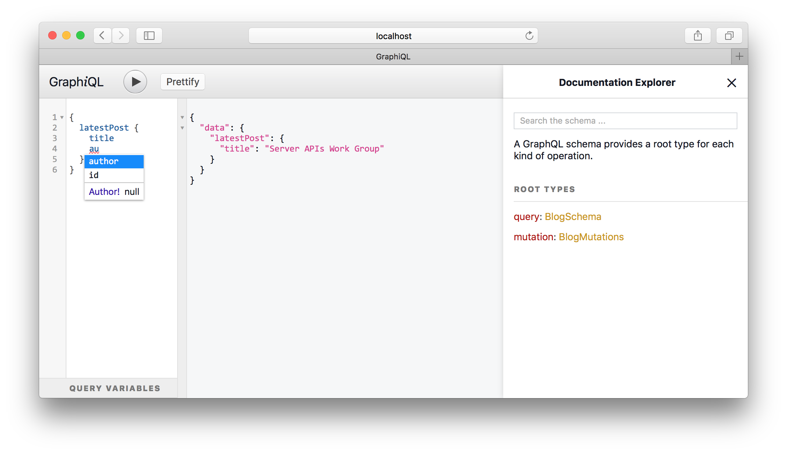
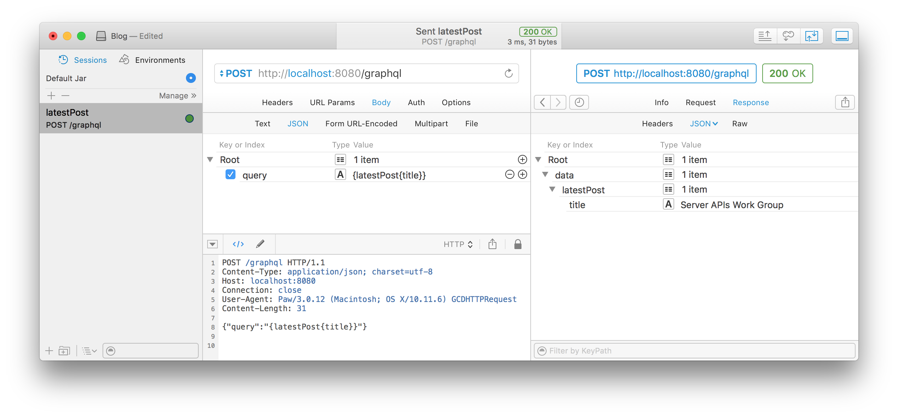

# GraphQL Examples

[![Swift][swift-badge]][swift-url]
[![License][mit-badge]][mit-url]
[![Slack][slack-badge]][slack-url]
[![Travis][travis-badge]][travis-url]

## Instructions

```sh
git clone https://github.com/Zewo/GraphQLExamples
swift package generate-xcodeproj
open GraphQLExamples.xcodeproj
```

Choose an application scheme from the drop down menu:



Click the run button ► or use the shortcut ⌘R. You should see the server running directly from your Xcode.



Open your browser and go to `http://localhost:8080/graphql`



You'll see [GraphiQL](https://github.com/graphql/graphiql). An in-browser IDE for exploring GraphQL. **GraphiQL** provides a text editor with auto-completion based on the apps schema. If you click `Docs` on the top right corner you'll be able to navigate the Documentation Explorer. Click the run button or ⌘Return to execute the request.

You can use any HTTP client to send GraphQL requests.



The example above sends a POST HTTP request with the GraphQL request inside the `query` JSON object key.

For more information take a look at:

- [GraphQLResponder](https://github.com/Zewo/GraphQLResponder)
- [Graphiti](https://github.com/GraphQLSwift/Graphiti)

## Support

If you need any help you can join our [Slack](http://slack.zewo.io) and go to the **#help** channel. Or you can create a Github [issue](https://github.com/Zewo/Zewo/issues/new) in our main repository. When stating your issue be sure to add enough details, specify what module is causing the problem and reproduction steps.

## Community

[![Slack][slack-image]][slack-url]

The entire Zewo code base is licensed under MIT. By contributing to Zewo you are contributing to an open and engaged community of brilliant Swift programmers. Join us on [Slack](http://slack.zewo.io) to get to know us!

## License

This project is released under the MIT license. See [LICENSE](LICENSE) for details.

[swift-badge]: https://img.shields.io/badge/Swift-3.0-orange.svg?style=flat
[swift-url]: https://swift.org
[mit-badge]: https://img.shields.io/badge/License-MIT-blue.svg?style=flat
[mit-url]: https://tldrlegal.com/license/mit-license
[slack-image]: http://s13.postimg.org/ybwy92ktf/Slack.png
[slack-badge]: https://zewo-slackin.herokuapp.com/badge.svg
[slack-url]: http://slack.zewo.io
[travis-badge]: https://travis-ci.org/Zewo/GraphQLResponder.svg?branch=master
[travis-url]: https://travis-ci.org/Zewo/GraphQLResponder
[codecov-badge]: https://codecov.io/gh/Zewo/GraphQLResponder/branch/master/graph/badge.svg
[codecov-url]: https://codecov.io/gh/Zewo/GraphQLResponder
[codebeat-badge]: https://codebeat.co/badges/97fc8ffa-eff3-495f-b61d-b3c5d29f2280
[codebeat-url]: https://codebeat.co/projects/github-com-zewo-graphqlresponder